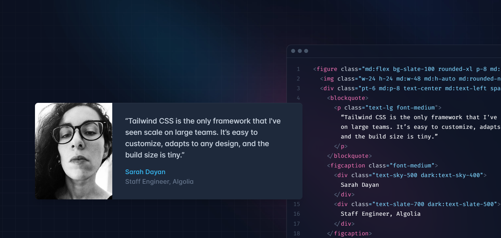
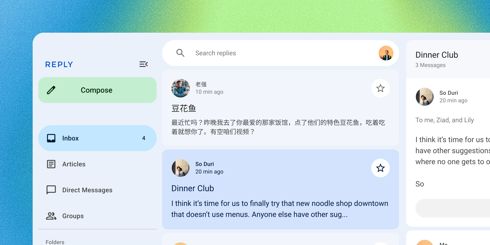

<!-- catalog-only-start --><!-- ---
name: Introduction
title: Introduction
order: 1
-----><!-- catalog-only-end -->
# Why ngx-tailwindui?
I love Angular and Tailwind CSS. One day I was starting a new Angular project in which I wanted to use Tailwind UI components, but since there was no implementation available for Angular at that time, I started building ngx-tailwindui.

# What is ngx-tailwindui?

An open-source [Angular](https://angular.dev/) components library, crafted with [Tailwind CSS](https://tailwindcss.com/) and Google's [Material Design](https://material.io/)<!-- {.external} --> guidelines. It's also defined as *The [Tailwind UI](https://tailwindui.com/) components library for Angular.*

## What is Tailwind CSS?
A utility-first CSS framework packed with classes like ```flex, pt-4, text-center``` and ```rotate-90``` that can be composed to build any design, directly in your markup.



## What is Material Design?

Material Design is a design system built and supported by Google designers and developers.

The latest version, Material 3, enables personal, adaptive, and expressive experiences – from dynamic color and enhanced accessibility, to foundations for large screen layouts and design tokens.



## What are web components?

[Web components](https://developer.mozilla.org/en-US/docs/Web/API/Web_components)<!-- {.external} -->
are custom HTML elements with encapsulated styles and behavior. They work across many different frameworks (such as Lit, React, Vue, and Svelte) as well as web environments (such as Eleventy, Wordpress, and Ruby on Rails).

Many components in this library are drop-in replacements for browser elements like `<button>` and `<input>`.

```html
<!-- Browser elements -->
<form>
  <label>
    Email
    <input type="email" name="email" required>
  </label>
  <label>
    Subscribe
    <input type="checkbox" name="subscribe">
  </label>

  <button type="reset">Reset</button>
  <button>Submit</button>
</form>

<!-- ngx-tailwindui elements -->
<form>
  <md-outlined-text-field label="Email" type="email"
      name="email" required></md-outlined-text-field>
  <label>
    Subscribe
    <md-checkbox name="subscribe"></md-checkbox>
  </label>

  <nxt-button variant="text">Reset</nxt-button>
  <nxt-button>Submit</nxt-button>
</form>
```